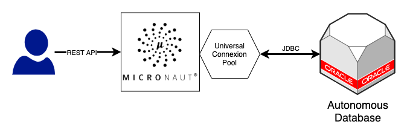

# Micronaut with Autonomous Database (Hibernate)

JAVA Micronaut framework connecting with Oracle Autonomous Database

## Why

Get started with a modern JAVA Framework to develop a RESTful service backed up by Oracle Autonomous Databadse.

## How

This project uses Oracle Universal Connection Pool (UCP) and Hibernate.

Define the following environment variables:

- `DB_SERVICE` with the service, for example `mydb_high`, `mydb_low`, etc.
- `DB_USER` database user name
- `DB_PASSWORD` database user password
- `TNS_ADMIN` pointing to your unzipped Wallet folder

Run the application with:

`./gradlew run`

Test with `curl`:

- `curl -XPOST -H "Content-Type: application/json" -d '{"name": "Victor"}' localhost:8080/documents`
- `curl -s localhost:8080/documents`
